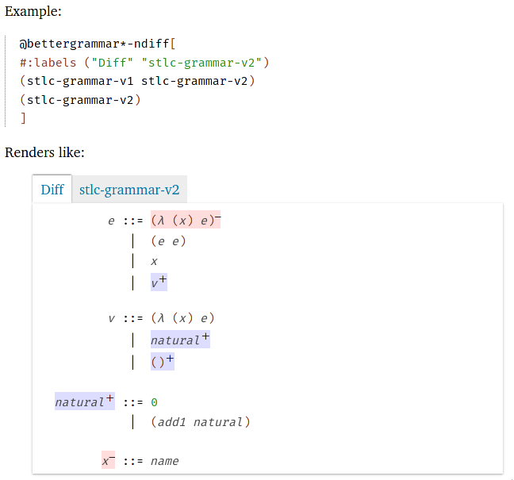

scribble-bettergrammar
===

A library for typesetting `racketgrammar`s, but better.
It supports defining and reusing grammars, annotations for differences and
changes between grammars, automatically computing the difference between two
grammars (using `sexp-diff`), rendering grammar differences with both
highlighting and annotations to emphasize what has changed between grammars, and
creating new grammar typesetters akin to `racket`, `racketblock`, and `racketblock0`.

Currently only comes with built-in style for HTML backend, but it should be simple to write your own TeX style.

Install via `raco pkg install scribble-bettergrammar` (or install
`scribble-bettergrammar-lib` or `scribble-bettergrammar-doc` separately).

An example from the docs:

